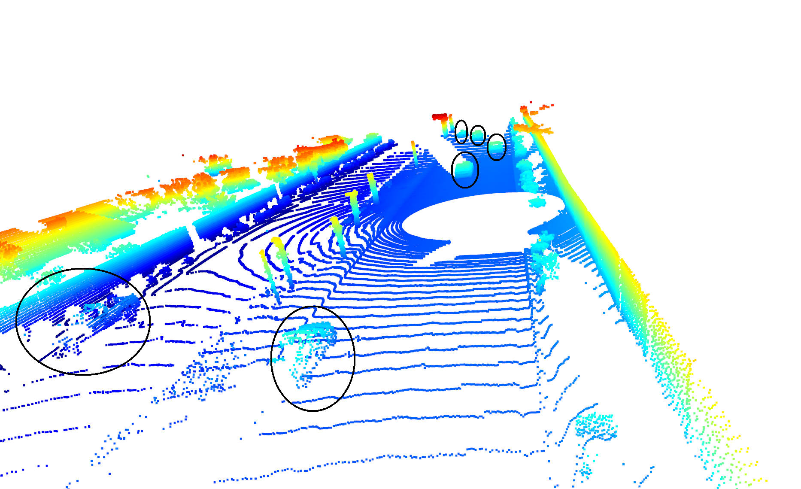
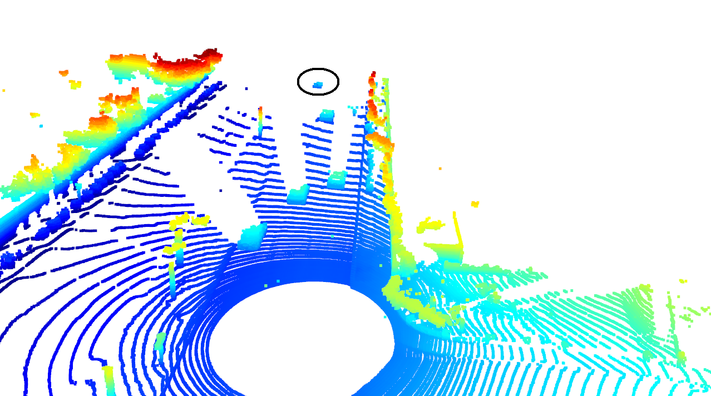
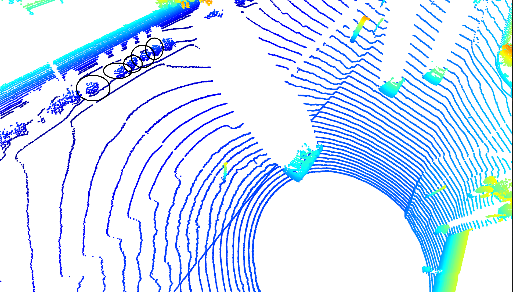
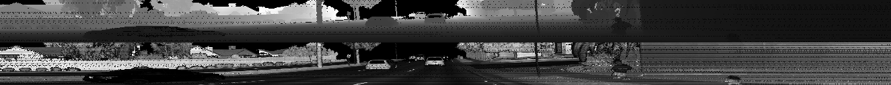

# Writeup: Mid-Term Project: 3D Object Detection

Below are examples of vehicles in the pointcloud that are relatively easy to spot, as they are well within the field of view of the lidar and their features are clearly distinguishable.

Below are some examples that are more difficult to see

It can be seen in the point cloud that the most distinguishable features of the vehicles are their bumpers and their taillights. This is due to their high reflectivity as can be seen in the intensity image in the lower half of the image below.

# Writeup: Track 3D-Objects Over Time

### 1. Write a short recap of the four tracking steps and what you implemented there (filter, track management, association, camera fusion). Which results did you achieve? Which part of the project was most difficult for you to complete, and why?

### 2. Do you see any benefits in camera-lidar fusion compared to lidar-only tracking (in theory and in your concrete results)? 

### 3. Which challenges will a sensor fusion system face in real-life scenarios? Did you see any of these challenges in the project?

### 4. Can you think of ways to improve your tracking results in the future?

