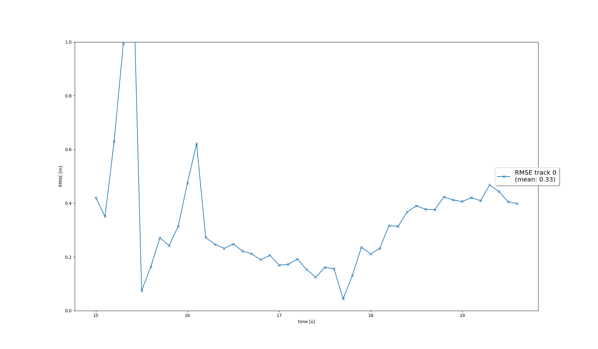
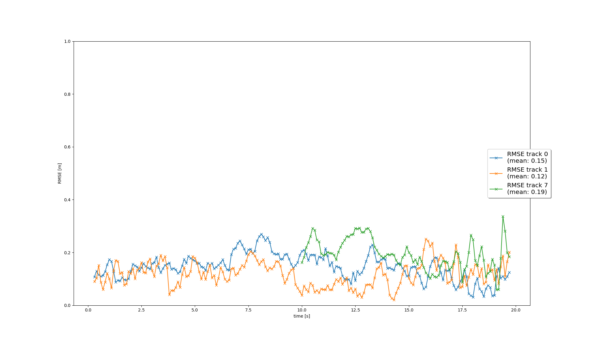
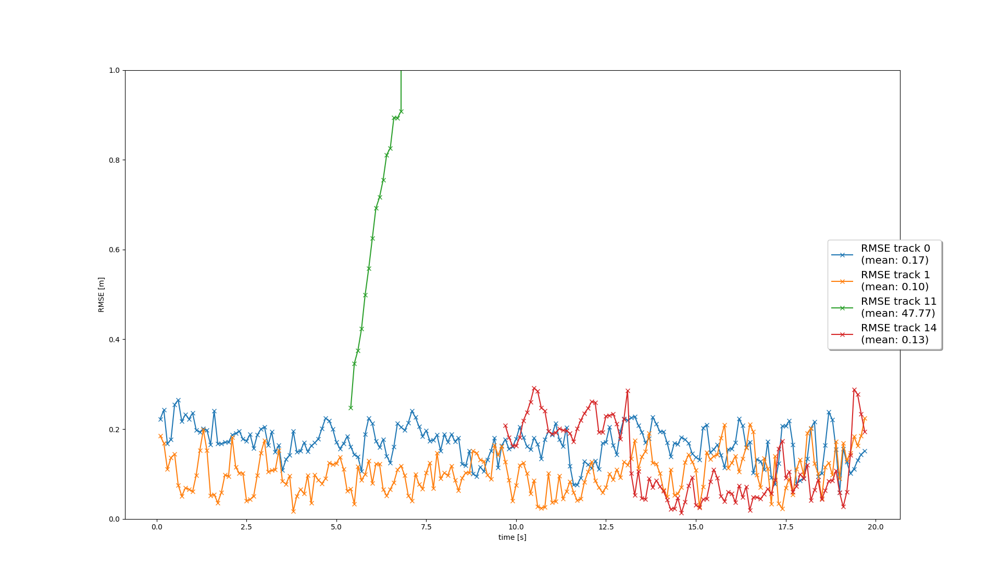

# Writeup: Mid-Term Project: 3D Object Detection

Below are examples of vehicles in the pointcloud that are relatively easy to spot, as they are well within the field of view of the lidar and their features are clearly distinguishable.

Below are some examples that are more difficult to see

It can be seen in the point cloud that the most distinguishable features of the vehicles are their bumpers and their taillights. This is due to their high reflectivity as can be seen in the intensity image in the lower half of the image below.

# Writeup: Track 3D-Objects Over Time

### 1. Write a short recap of the four tracking steps and what you implemented there (filter, track management, association, camera fusion). Which results did you achieve? Which part of the project was most difficult for you to complete, and why?

1. **Filter**: This step involved implementing the predict and update functions of the Kalman Filter. I have implemented the system matrix, the residual function as well as the functions calculating the matrices of the process noise covariance and the residual covariance. I have integrated those elements in the update and predict functions

   
   
2. **track management**: This step involved writing the logic for initializing new tracks, deleting old tracks and updating existing tracks. I have implemented the initialization of the track state from lidar measurements as well as the track state and track score. I have implemented the logic to decrease the track score of unassociated tracks and evaentually delete them once they fall below the defined threshold (or their uncertrainty grows). I have also implemented the update of tracks and increase of their scores

3. **association**: This step involves writing the steps for associating tracks to measurements. This is done by calculating the MMahalanobis distance values between all tracks and all measurements, which takes the covariance of the tracks into account, and storing the distances in the association matrix. Later, the association matrix is used to find the closest track and measurement pair, in order to associate them to each other and removing them from the matrix. Doing this repeatedly determines all the track-measurement pairs, leaving the unassociated tracks and measurements behind. I also implemented the gating function which is used to reduces the association complexity by removing unlikely association pairs.

   

4. **camera fusion**: In this step, I implemented the nonlinear camera measurement function which maps the state vector to the measurement space, which is in 2D image coordinates. In addition I implemented a function that determines whether a track object is within the FOV of the sensor to determine whether or not its score should be decreased. The RMSE plot of the final test run with both camera and lidar is shown below. Also see the video "my_tracking_results.avi" in the root directory of this repository.
    
    

The result is a multi-target tracking algorithm that can spawn, maintain and delete multiple objects detected by both the camera and the lidar. The tracker performs quite well and reaches decent RMSE values without many ghost objects. The hardest part of the project was the math behind Kalman Filters, specifically the statistical part, as it is a little complicated to interpret.

### 2. Do you see any benefits in camera-lidar fusion compared to lidar-only tracking (in theory and in your concrete results)? 

Using the camera in addition to the lidar significantly stabilized the tracker, because the camera is a second sensor, that can confirm or deny what the lidar detects. This resulted, in my results, to less ghost objects. In addition, using the camera, the tracker was able to detect  more vehicles, especially smaller vehicles that are further away.

### 3. Which challenges will a sensor fusion system face in real-life scenarios? Did you see any of these challenges in the project?
A real-life sensor fusion system will presumably include more sensors and employ more complicated algorithms in the association and track management for example. A lot of the threshold values and parameters used come from experience and it might be difficult to determine them for a more complicated system with safety-critical implications, so that the tracker performs well under all conditions. Also, analyzing the performance or issues of the tracker can be difficult, because the intermediate steps such as the covariance matrices etc. are not easy to interpret, which was already challenging in this project.

### 4. Can you think of ways to improve your tracking results in the future?

Incorporate better association and track management algorithms to perform well under occlusions for example or in different weather conditions.